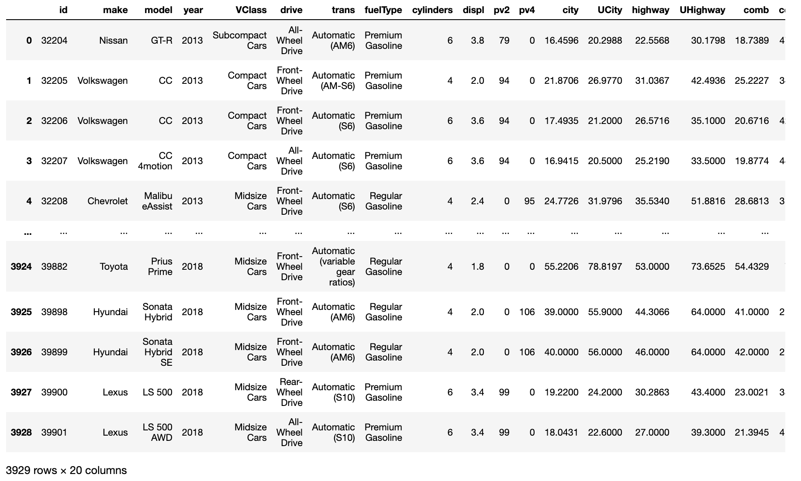
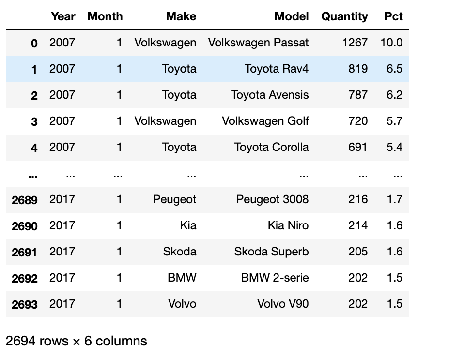
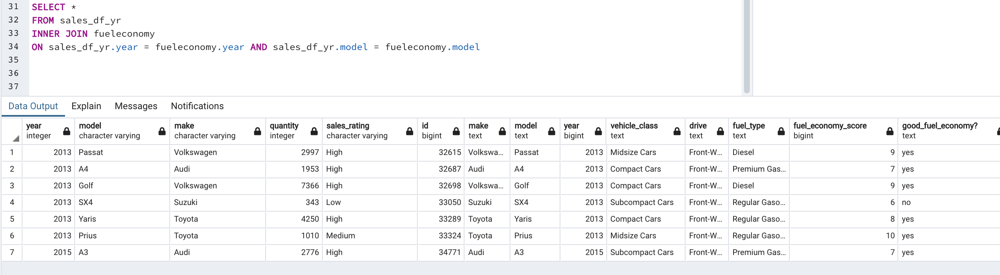

# Norway Automobile Market ETL Project

For this group project we took a look into which characteristics in vehicles drive sales in Norway. 

Extract

From Kaggle, we found our two data sources.  One involved the Fuel Economy usage by Car Type, and the other being car sales in Norway, both of which were CSV files.  Using Pandas, dataframes were created from those csv’s, which were then exported as tables to pgAdmin 4. 
Sources: https://www.kaggle.com/minaboulos/fuel-economy
https://www.kaggle.com/dmi3kno/newcarsalesnorway?select=norway_new_car_sales_by_model.csv 

Car Model Specs

Norway Car Sales

Transform

Both datasets had a lot of duplicates that needed to get dropped in order to  establish the primary keys.  For the fuel economy dataset, many columns were not necessary for the overall understanding of the dataset and were dropped.  A column that asked if the fuel economy score given ended up being good was added as an easy identifier for fuel economy.  Numerous duplicates were dropped in order to make way for the primary keys.  For the Norway Sales dataset, a few columns were dropped for more relevant columns.  A new column scoring the sales rating of each car model was added to easily show how well a car had sold during that year.  Hidden characters were found when encoding the csv into latin1, which were then cut out using .str.lstrip().  

Load

The final database features both datasets on a left join with the Model and Year being the Primary Keys for both datasets.  The datasets shared many of the same car models and the year they were manufactured which made determining the keys easy.   With the datasets joined together, it showed primarily the Norway sales followed by the fuel economy score of each car that was graded on each car.  The resulting table is set up for an analysis involving what car characteristics drive car sales in Norway and how they may evolve over time.  

